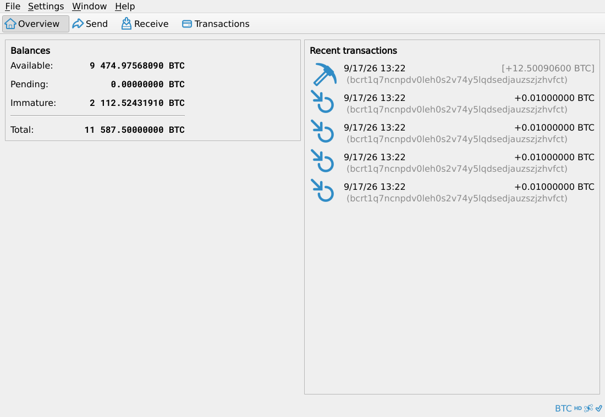

# btc-core-in-browser

Bitcoin Core compiled to WebAssembly. The real Qt application, its validating
node and its wallet, running in a browser tab with nothing installed.

**Try it: <https://bitsaga.be/bitcoin-core-browser/>** (desktop, about 20 MB)



Not a reimplementation and not a subset. This is bitcoin/bitcoin at tag `v31.1`,
commit `9be056a`, cross compiled with Emscripten, plus three patches that are all
about the browser lacking something a desktop has. None touches consensus,
validation or the wallet.

## What runs

Real Qt widgets and menus, real LevelDB, real secp256k1, script verification on
four threads backed by web workers. The chain is regtest and comes baked in.

A native `bitcoind` opened the datadir the WebAssembly build wrote and reported
the same best block hash, so the on-disk format is identical in both directions.

| | |
|---|---|
| Chromium, 330 blocks / 1831 transactions | 0.66 s |
| native x86-64, same input | 0.24 s |
| `bitcoin-qt.wasm` | 55 MB, 20 MB over the wire |

About 3x native, measured on a run short enough that startup is part of it.

## What does not work

- **Nothing persists.** The filesystem is in memory. LevelDB over OPFS is the
  next piece of work.
- **No peers.** WebAssembly has no raw TCP. Core's `Sock` is fully virtual and
  `CreateSock` is a swappable `std::function`, so a WebSocket implementation
  needs no fork of the net layer.
- **Chromium only, desktop only.** Firefox and Safari are untested. The page
  refuses to start on a phone before downloading anything.

## Build

Linux on x86-64 with GNU tools, `cmake`, `git`, `python3`, `curl`, about 6 GB
free. Everything else is fetched and pinned.

```sh
./build-gui.sh                                     # the application
```

```sh
./deploy.sh build/gui/bin /path/to/webroot         # stage it, content-hashed
```

```sh
./build.sh                                         # validation engine alone
```

Serving it needs `Cross-Origin-Opener-Policy: same-origin` and
`Cross-Origin-Embedder-Policy: require-corp`, or the browser withholds
SharedArrayBuffer and the verification threads never start. The nginx block that
sends them is in `infra/nginx/`.

## Reproducible

Two checkouts at different paths and one fresh clone with an empty build
directory all produced these:

```
bitcoin-qt.wasm  8db7dfa9b92e65292a8b0c866563a9e64a14b8cd00d530127fc6327c97999be4
bitcoin-qt.js    c376263e21bcac5aa43174a2a37f3861d6dd64e149f82ed8398640395ed4f368
bitcoin-qt.data  85133590af8ebf8bb4df7f40e92ab81e3a63c267738be689349557144f1c6ecf
```

```sh
./build-gui.sh && sha256sum build/gui/bin/bitcoin-qt.wasm
```

`build-info.json` is deployed beside the artifacts with the same hashes, the
Core commit and the hash of each patch. Pinned: Core by commit, emsdk by commit,
Qt via `aqtinstall==3.3.0`, SQLite and Boost by SHA256, the regtest chain as
`fixtures/regtest-chain.tar.gz`.

Only two paths on one machine have been compared. A different distro reproducing
it is unproven.

## Test

```sh
python3 -m venv .venv && .venv/bin/pip install -r requirements-test.txt
.venv/bin/playwright install chromium
```

```sh
.venv/bin/python test/browser_test.py 330                  # validation engine
.venv/bin/python test/gui_test.py /path/to/webroot         # the application
```

## Things that cost a day each

- **Boost must live in its own prefix.** Let `find_package` reach
  `/usr/include` and the host glibc headers shadow Emscripten's musl.
- **`HAVE_IFADDRS` is detected and then crashes.** Emscripten's `getifaddrs`
  links, then opens a netlink socket SOCKFS cannot create, killing Core before
  its first log line. Patch 0001.
- **`-pthread` belongs in `CMAKE_CXX_FLAGS`.** Later than that and CMake has
  already pinned the single threaded system libraries.
- **`-fexceptions`.** `AppInitMain` calls `std::filesystem::file_size` and
  catches the throw. By default a throw in Emscripten is an immediate abort.
- **`-sASYNCIFY`.** Core opens modal dialogs with `exec()`, which needs a nested
  event loop.
- **`-sDYNAMIC_EXECUTION=0`.** Removes the two `new Function` calls from the
  glue, so the page needs no `unsafe-eval`.
- **`SOURCE_DATE_EPOCH`.** Qt's `rcc` stamps the modification time of every file
  it packs. This was the last 542 differing bytes between two builds.
- **libevent is only required when the daemon, GUI, CLI or tests are on.**

## Analytics

`web-gui/boot.js` sends one Matomo page view, and only when served from
`bitsaga.be`. A clone serving it anywhere else sends nothing.

## License

MIT. Bitcoin Core is MIT and is fetched, not vendored.
